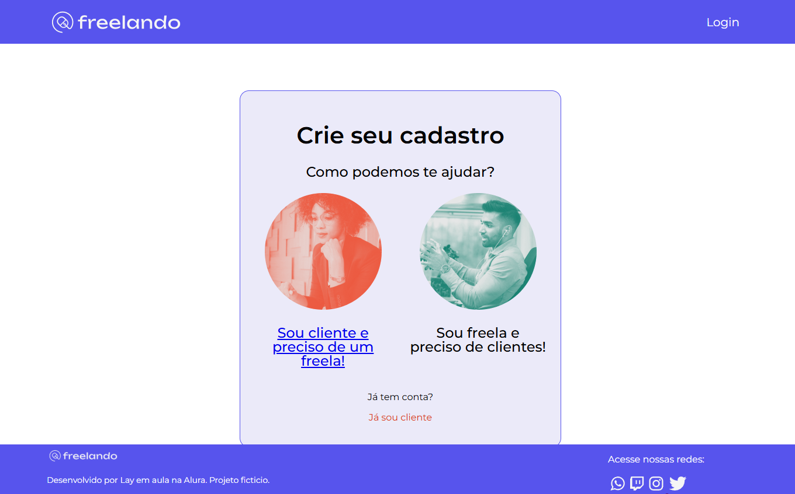

# Freelando

Site fictício que simula o cadastro em uma plataforma de freelancers.
Projeto desenvolvido em aula na Alura.

## Tecnologias Usadas 🖥 
  
  - React 
  - Emotion
  - Javascript
  - React-Router-Dom
  - Context-API
  

  ## Como usar 🔑

  `bash
git clone https://github.com/seu-user/nome-do-projeto
cd nome-do-projeto
npm install
npm start` 
  
link no vercel: [link](https://freelando-eight.vercel.app);

# Nota 📌
Este projeto contém apenas a rota de cadastro por enquanto.
Para visualizar o site, adicione /cadastro no final do link ou use o link direto acima.

## O que aprendi

Esse curso foi muito útil para firmar meus conhecimentos em Context-API, e aprender sobre roteamento com React Router DOM.
Também enfrentei vários desafios que me ajudaram a perder o medo de criar funcionalidades sozinha.
Minha visão sobre hooks e desestruturação de props ficou muito mais clara!

